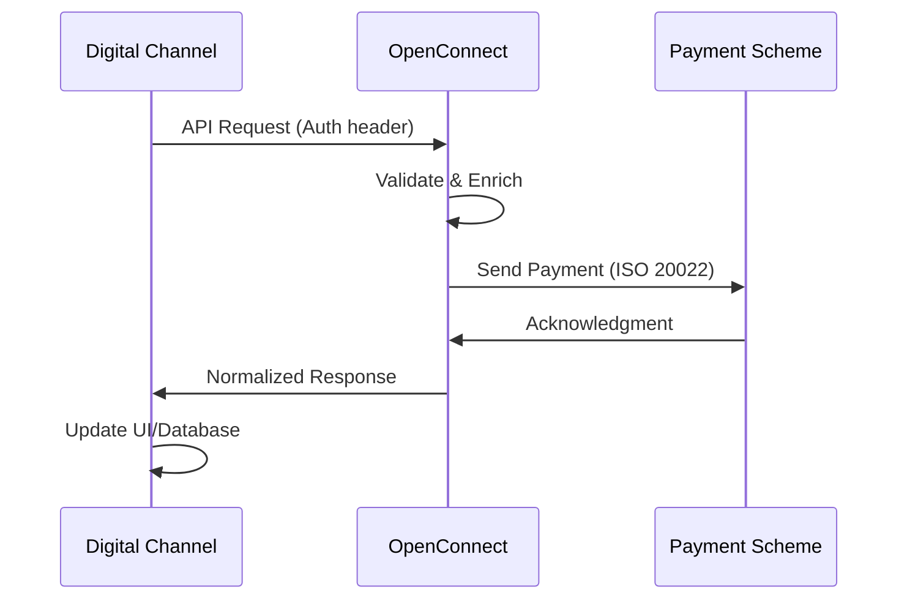

# OpenConnect — Enterprise Payment Middleware


OpenConnect is an **enterprise-grade API middleware** that orchestrates real-time payments, financial messaging, and transaction flows across banks, EMIs, fintechs, and payment schemes. It acts as a centralized switching layer, enabling secure, compliant, and scalable payment processing.

---

## 🎯 Purpose & Value

Modern payment ecosystems require:

| Requirement | Solution |
|-------------|----------|
| **Instant Payments** | Real-time processing on multiple rails |
| **Regulatory Compliance** | Built-in validation and audit trails |
| **Multi-Scheme Support** | Single API for all payment types |
| **Security & Transparency** | End-to-end encryption and traceability |
| **Scalability** | High-throughput, low-latency processing |

OpenConnect delivers these capabilities by:

✅ **Centralizing** payment orchestration  
✅ **Normalizing** APIs across different schemes  
✅ **Validating** business rules and compliance  
✅ **Routing** transactions intelligently  
✅ **Auditing** every transaction end-to-end  

---

## 🚀 Core Capabilities

### 1. **Person-to-Person (P2P) Payments**

Enable instant, secure user-to-user transfers using:
- Mobile numbers (MSISDN)
- National IDs (CNIC)
- IBANs
- Email addresses

**Use Cases**: Remittances, family transfers, bill splitting

```bash
# Example: Transfer via RAAST (Direct Posting)
POST /api/v3/paysyslabs/directposting
Authorization: Bearer <token>
{
  "info": { "rrn": "002236987456", "stan": "987456", ... },
  "senderinfo": { "fromAccount": "PK56AINI...", ... },
  "receiverinfo": { "bankBIC": "NBPBPKKA", "toAccount": "PK76NBPA...", ... },
  "paymentInfo": { "amount": 5000, "narration": "Payment", ... }
}
```

---

### 2. **Person-to-Merchant (P2M) Payments**

Enable **cashless merchant payments** via:
- Static QR codes
- Dynamic QR codes
- Request-to-Pay (RTP) flows

**Use Cases**: Retail checkout, bill payment, subscription billing

---

### 3. **Bulk Payments & Disbursements**

Support **high-volume, time-critical payouts**:
- Salary payments
- Government subsidies
- Refunds and reimbursements
- Corporate mass payouts

**Key Feature**: Batch-level and instruction-level traceability

---

### 4. **Bill Payment & Inquiries**

Unified bill payment service supporting:
- Electricity, water, and utility bills
- Telecom (prepaid & postpaid)
- Tax and government payments
- Merchant invoices

**Workflow**:
1. Bill Inquiry (validate bill details)
2. Bill Payment (process transaction)
3. Transaction Inquiry (verify status)

```bash
# Example: Fetch Bill Details
POST /api/v1/paysyslabs/payments/billinquiry
{
  "billInfo": {
    "billerId": 5,
    "consumerNo": "03132370605"
  }
}
```

---

### 5. **Alias Management**

Enable **privacy-preserving payments** without exposing full account details.

Supported aliases:
- **CNIC** (13 digits)
- **MOBILE** (11 digits)
- **EMAIL** (standard format)
- **TXT** (3-35 characters)

**Benefit**: Users can share payment identifiers without revealing bank accounts

---

### 6. **Payment Initiation (PISP)**

Enable **consent-based third-party payment initiation** for:
- Regulated fintech applications
- Open banking integrations
- Partner ecosystems

**Security Model**: OAuth 2.0 + PKI-based consent

---

## 🏗️ Architectural Overview

```
┌─────────────────────────────────────────────────────────┐
│           Digital Channels & Partners                   │
│  (Mobile Apps, Web Portals, Fintech APIs)               │
└──────────────────┬──────────────────────────────────────┘
                   │
                   ▼
┌─────────────────────────────────────────────────────────┐
│         OpenConnect API Gateway                          │
│  (Auth, Validation, Routing, Transformation)            │
└──────────────────┬──────────────────────────────────────┘
                   │
        ┌──────────┼──────────┬──────────┐
        ▼          ▼          ▼          ▼
    ┌────────┐ ┌────────┐ ┌────────┐ ┌────────┐
    │ RAAST  │ │ 1LINK  │ │ NADRA  │ │Telcos  │
    │        │ │        │ │        │ │        │
    └────────┘ └────────┘ └────────┘ └────────┘
```

**Flow**:
1. Channel sends API request to OpenConnect
2. OpenConnect validates and enriches request
3. OpenConnect converts to scheme-specific format (ISO 20022)
4. OpenConnect routes to appropriate payment rail
5. Response is normalized and returned to channel

---

## 🔐 Security Features

| Feature | Implementation |
|---------|-----------------|
| **Authentication** | JWT Bearer tokens with PKI-based validation |
| **Encryption** | TLS 1.2+ for all APIs, AES-256 at rest |
| **Validation** | Input sanitization, schema validation, business rules |
| **Audit Trail** | Immutable logs with correlation IDs for traceability |
| **Rate Limiting** | Per-channel, per-IP throttling |
| **Data Masking** | CNIC, account numbers masked in logs |

---

## 📊 Supported Payment Rails

| Rail | Type | Use Case | Status |
|------|------|----------|--------|
| **RAAST** | Real-time P2P, P2M, Bulk | Instant transfers | ✅ Active |
| **1LINK (IBFT)** | Interbank transfer | Next-day settlement | ✅ Active |
| **NADRA BPS** | Bill payment aggregation | Utilities, tax | ✅ Active |
| **Telco APIs** | Prepaid/postpaid | Mobile top-ups | ✅ Active |

---

## 📈 API Statistics

```
Total Endpoints:     15+ RESTful APIs
Non-Financial:       10 (inquiry, list, validation)
Financial:           5+ (payment processing)
Response Time:       < 2 seconds (average)
Availability SLA:    99.9%
Throughput:          1000+ TPS
```

---

## 🎓 Key Concepts

### **Correlation ID**
Unique identifier for tracking a transaction across all systems. Returned in every response for debugging and audit purposes.

```json
{
  "info": {
    "correlationId": "7ad7bf9f-99dc-4c2c-ab88-abddb87789a0"
  }
}
```

### **RRN & STAN**
- **RRN** (Retrieval Reference Number): 12-digit transaction identifier
- **STAN** (System Trace Audit Number): 6-digit sequence number

### **Response Codes**
OpenConnect uses standardized response codes:
- `0000` = Success
- `0401` = Invalid parameters
- `0402` = Unauthorized
- `0468` = Mandatory fields missing
- `0500` = Internal error

### **Request to Pay (RTP)**
Merchant-initiated payment flow where customer approves transaction before processing:
1. Merchant sends RTP request
2. Customer receives notification
3. Customer approves/rejects
4. Payment executes based on response

---

## 🔄 Typical Integration Flow



---

## 👥 Who Should Use OpenConnect

| Organization | Benefits |
|--------------|----------|
| **Banks** | Instant payments, bulk payouts, regulatory compliance |
| **EMIs & Wallets** | P2P/P2M capabilities, brand-agnostic processing |
| **Fintechs** | PISP features, open banking integration |
| **Government** | Subsidy disbursement, tax collection |
| **Enterprises** | Mass payroll, vendor payments |

---

## 📚 Next Steps

- **[API Specifications](/api-specifications)** — Detailed endpoint documentation and OpenAPI reference
- **[Developer Workflow](/developerworkflow)** — Setup, testing, and deployment
- **[Data Type Reference](/dataTypeRef)** — Field definitions and data structures
- **[Back Office](/backoffice)** — Administrative and management features

---

## 💡 Quick Facts

- **Language**: Node.js / REST API
- **API Spec**: OpenAPI 3.0.3 (Swagger)
- **Base URL**: `http://localhost:3006` (local) | `https://api.openconnect.paysyslabs.com` (production)
- **Response Format**: JSON
- **Auth Method**: Bearer Token (JWT)
- **Rate Limit**: 100 requests / 15 minutes per IP

---

**Need Help?**  
📧 Email: support@paysyslabs.com  
📖 Docs: https://docs.openconnect.paysyslabs.com  
🐛 Issues: Create an issue in the GitHub repository  

**Last Updated**: January 2024  
**Version**: 1.0.0
